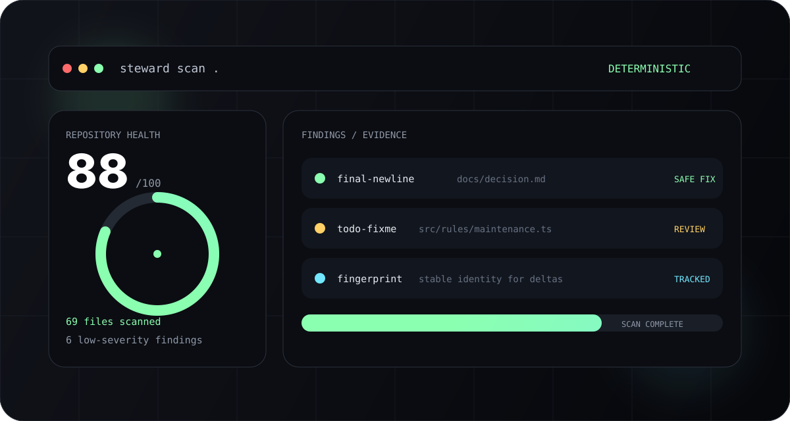
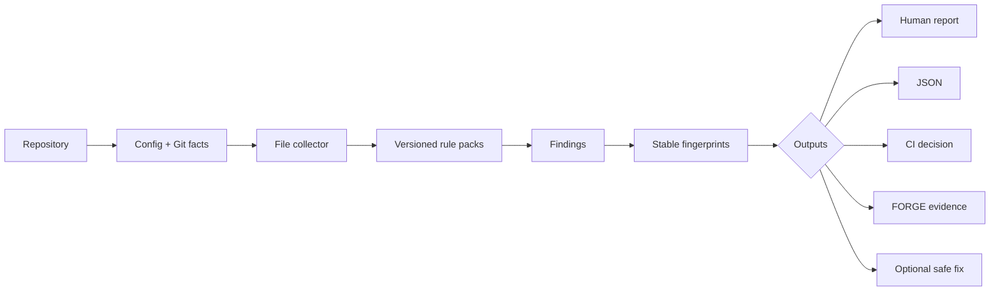

<a name="readme-top"></a>

<div align="center">



<p>
  <a href="https://github.com/gODtECH-Ctl-Create/gODtECH-Steward/actions"></a>
  <a href="https://www.npmjs.com/package/@godtech/steward"></a>
  <a href="https://www.npmjs.com/package/@godtech/steward"></a>
  <a href="https://github.com/gODtECH-Ctl-Create/gODtECH-Steward/releases/tag/v0.1.0"></a>
  <a href="./LICENSE"></a>
</p>

### Deterministic software and repository housekeeping.


<p>
  <a href="https://godtech-ctl-create.github.io/gODtECH-Steward/">Website</a> ·
  <a href="https://www.npmjs.com/package/@godtech/steward">npm</a> ·
  <a href="https://github.com/gODtECH-Ctl-Create/gODtECH-Steward/releases/tag/v0.1.0">Release</a> ·
  <a href="#-quick-start">Quick start</a> ·
  <a href="#-what-steward-checks">What it checks</a> ·
  <a href="#-architecture">Architecture</a>
</p>

</div>

---

## ⚡ The 30-second version

**gODtECH Steward** turns software housekeeping into a repeatable engineering step.

It inspects a repository deterministically, produces explainable findings, calculates a health signal, and offers only explicitly supported safe remediation. The normal scan path does not require artificial intelligence (AI), a hosted service, or a model call.

```text
REPOSITORY
    ↓
CONFIG + GIT FACTS
    ↓
DETERMINISTIC RULE PACKS
    ↓
FINDINGS + FINGERPRINTS
    ↓
HEALTH + REPORTS + CI
    ↓
OPTIONAL SAFE FIX
```

Steward is intentionally **not** an autonomous cleanup bot. It does not delete uncertain files, rewrite architecture, or silently mutate the repository.

> **v0.1.0 is public.** The package is available on npm, the GitHub Action is available from the repository, and the release workflow publishes with npm Trusted Publishing plus GitHub artifact attestations.

---

## 🚀 Quick start

### Install from npm

```bash
npm install -g @godtech/steward@0.1.0
steward --version
```

Windows PowerShell may block the generated `.ps1` shim because of the local execution policy. In that case, use the Windows command shim:

```powershell
npm.cmd install -g @godtech/steward@0.1.0
steward.cmd --version
```

### Scan a repository

```bash
cd /path/to/your-project
steward scan .
```

Machine-readable output:

```bash
steward scan . --json
```

Diagnostic summary:

```bash
steward doctor .
```

### Run safe remediation

Preview first:

```bash
steward fix . --safe --dry-run
```

Apply only supported safe fixes:

```bash
steward fix . --safe
```

### Install the GitHub Action

```yaml
name: Steward

on:
  pull_request:
  push:

permissions:
  contents: read

jobs:
  steward:
    runs-on: ubuntu-latest
    steps:
      - uses: actions/checkout@v4
      - uses: gODtECH-Ctl-Create/gODtECH-Steward@v0.1.0
```

Prefer a reviewed release tag or exact commit SHA over a moving development branch in production workflows.

---

## 🧭 Why Steward exists

Repository health degrades quietly. Generated outputs get committed. Documentation links rot. lockfiles drift. Conflict markers survive a rushed merge. Secret-like material accidentally enters Git. Old maintenance markers accumulate until nobody knows whether they still matter.

Steward makes those signals visible without turning housekeeping into a destructive automation problem.

| Common problem | Steward's answer |
| --- | --- |
| “Is this repository healthy?” | Deterministic health score + severity summary |
| “What exactly is wrong?” | File-scoped findings with explanations and remediation guidance |
| “Can I automate the cleanup?” | Only explicitly fixable findings can be remediated |
| “Can another tool consume the result?” | Versioned JSON contract with stable fingerprints |
| “Did the repository improve?” | Before/after delta reporting |
| “Can this run in CI?” | Deterministic CI threshold mode + GitHub Action |
| “Can FORGE use the evidence?” | Dedicated `forge-evidence` projection |

---

## ✨ What Steward checks

| Area | Current coverage |
| --- | --- |
| **Repository** | README conventions, `.gitignore`, large files, tracked disposable artifacts, generated test/tool outputs |
| **Security** | Tracked environment files and high-confidence credential-like patterns |
| **Documentation** | Broken and malformed local Markdown links |
| **Dependencies** | Conflicting package-manager metadata and lockfiles, invalid package metadata |
| **Project metadata** | Package identity, descriptions, publishable package completeness |
| **Maintenance** | Merge-conflict markers and TODO/FIXME maintenance signals |
| **Hygiene** | Trailing whitespace and missing final newlines |
| **Reporting** | Health score, severity/category counts, JSON output, stable fingerprints |
| **Rule packs** | Versioned built-in `core` and `security` packs with policy controls |
| **Deltas** | Deterministic health and finding changes between reports |
| **FORGE evidence** | Safe observed repository-health evidence for gODtECH FORGE workflows |
| **Trusted packs** | Manifest, policy, digest, publisher signature, and WebAssembly (WASM) verification boundary |

Steward deliberately does not treat every `dist/` or `build/` directory as disposable. Projects may intentionally ship compiled output.

---

## 🌀 How it works



The important boundary is simple:

**Steward observes first. It does not guess what you meant to delete.**

---

## 📊 Health, findings, and deltas

A scan produces more than a list of warnings.

```text
Health 88/100
69 files scanned | 69 text files

Findings: 6
Critical 0 | High 0 | Medium 0 | Low 6 | Info 0
```

Each finding can carry:

- rule and category;
- severity and confidence;
- path and line where available;
- remediation guidance;
- whether an explicit safe fix exists;
- a stable SHA-256 fingerprint for correlation.

Generate a report:

```bash
steward report . --output current.json
```

Compare against an earlier report:

```bash
steward report . --output current.json --compare previous.json
```

The delta tracks health, added/resolved findings, severity changes, and category changes without copying source contents or secret values into the comparison artifact.

---

## 🛡️ Safety model

Steward follows one operating rule:

> **Observe first. Explain second. Modify only when explicitly safe.**

Scanning is read-only. `--dry-run` never writes. `fix` refuses to modify files without `--safe`, and security findings are observation-only.

External executable rule packs use a separate verification-first boundary:

```text
manifest
  ↓
compatibility
  ↓
allowlist + publisher trust
  ↓
SHA-256 digest
  ↓
Ed25519 signature
  ↓
WASM validation
  ↓
optional sandbox probe
```

**Third-party executable rule packs are still disabled in the 0.1.x release line.** The current implementation verifies the trust boundary but does not load arbitrary external executable rules into ordinary repository scans.

---

## 🧩 Rule packs

Built-in analysis is organized into versioned packs so Steward can grow without turning the scanner into a hard-coded monolith.

```text
core@2
├── repository
├── documentation
├── dependencies
├── maintenance
├── metadata
└── hygiene

security@1
└── security
```

Disable an entire pack:

```json
{
  "packs": {
    "disabled": ["security"]
  }
}
```

Disable individual rules:

```json
{
  "rules": {
    "disabled": ["todo-fixme"]
  }
}
```

Use:

```bash
steward rules .
```

to inspect active pack and rule state.

---

## 🔌 FORGE + StackPilot

Steward is independent, but it fits into the wider gODtECH engineering system through public contracts.

```text
                    gODtECH FORGE
             orchestration / policy / workflow
                         │
             ┌───────────┴───────────┐
             │                       │
             ▼                       ▼
        StackPilot                Steward
           BUILD                KEEP HEALTHY
             │                       │
             └───────────┬───────────┘
                         ▼
                   TARGET PROJECT
```

### gODtECH FORGE

FORGE may call Steward when repository-health evidence or safe maintenance is relevant. Steward exposes a dedicated observed-evidence artifact:

```bash
steward forge-evidence . --output .steward-forge-evidence.json
```

The artifact does not fabricate FORGE benchmark IDs, control/assisted runs, provider billing, or productivity claims.

### StackPilot

StackPilot may consume the public Steward scan contract while retaining ownership of scaffolding, golden paths, and stack-specific readiness.

Neither integration is required for Steward to work.

---

## 📦 Configuration

Initialize a repository-owned configuration:

```bash
steward init .
```

This creates `.steward.json`, allowing repository-specific policy without changing the engine.

Example:

```json
{
  "version": 1,
  "exclude": ["vendor/**"],
  "ci": {
    "failOn": "critical"
  },
  "packs": {
    "disabled": []
  },
  "rules": {
    "disabled": []
  },
  "externalPacks": {
    "requireSigned": true,
    "allow": ["example.security-hygiene"],
    "trustedPublishers": ["example-org"]
  }
}
```

Malformed external-pack trust configuration fails closed during `steward pack verify`.

---

## 🏗️ Architecture

```text
                    +----------------+
                    |  CLI / Action  |
                    +-------+--------+
                            |
                            v
                    +---------------+
                    | Scan pipeline |
                    +-------+-------+
                            |
          +-----------------+-----------------+
          |                 |                 |
          v                 v                 v
     config + Git       file collector     rule packs
          |                 |                 |
          +-----------------+-----------------+
                            |
                            v
                    stable findings
                            |
              +-------------+-------------+
              |             |             |
              v             v             v
            human         JSON            CI
            report        contract        gate
                            |
                            +---------> FORGE evidence
                            |
                            v
                     safe remediation
                            |
                            v
                         delta

External pack verification:
manifest → policy → digest → signature → WASM → probe
```

Core rules implement a read-only `StewardRule` contract and return data-only findings. The scanner owns orchestration, while adapters own presentation or integration contracts.

---

## 🧰 Command map

| Command | Purpose |
| --- | --- |
| `steward init` | Create repository-owned `.steward.json` configuration |
| `steward scan` | Deterministic repository-health scan |
| `steward doctor` | Scan plus concise health/category diagnostics |
| `steward rules` | Inspect active rule packs and rules |
| `steward report` | Write a JSON report and optional delta |
| `steward forge-evidence` | Export observed repository-health evidence for FORGE |
| `steward fix --safe` | Apply only explicitly supported safe fixes |
| `steward pack verify` | Verify a trusted external rule-pack artifact |

---

## 🔐 Release + provenance

**gODtECH Steward 0.1.0** is publicly released.

The release pipeline is tag-driven and includes:

- npm Trusted Publishing through OpenID Connect (OIDC);
- GitHub artifact attestations for the npm tarball and its Software Bill of Materials (SBOM);
- SHA-256 release checksums;
- package distribution verification on Ubuntu and Windows;
- automated npm publication verification;
- automated GitHub Release creation.

[View the npm package →](https://www.npmjs.com/package/@godtech/steward)  
[View the v0.1.0 release →](https://github.com/gODtECH-Ctl-Create/gODtECH-Steward/releases/tag/v0.1.0)

---

## 🌐 Website

The product landing page is published through GitHub Pages:

**https://godtech-ctl-create.github.io/gODtECH-Steward/**

It mirrors the same release facts and install paths as this README and is intentionally a static site with no application backend.

---

## 🧪 Development

Steward follows the gODtECH FORGE delivery model: material work is implemented on a dedicated branch, verified, and documented before merge.

```bash
npm ci
npm run check
npm run build
npm test
npm run verify:package
```

For release work:

```bash
npm run verify:release
```

See the release procedure in [`docs/release.md`](docs/release.md) and architecture in [`docs/architecture.md`](docs/architecture.md).

---

## 🗺️ Roadmap

The foundation and first public release are complete. Near-term work focuses on improving signal quality and expanding deterministic analysis only where evidence justifies the complexity.

- [x] Deterministic repository scanner
- [x] Versioned rule packs
- [x] Stable finding fingerprints
- [x] Health scoring and CI mode
- [x] Safe remediation + dry-run
- [x] JSON reports and deltas
- [x] FORGE evidence adapter
- [x] StackPilot contract boundary
- [x] Trusted external pack verification prototype
- [x] Public npm release with provenance and attestations
- [x] GitHub Pages product site
- [ ] Additional high-signal language-aware health checks
- [ ] Full audited execution model for trusted external executable packs

---

## 📄 License

Steward is available under the **Apache License 2.0**. See [`LICENSE`](./LICENSE).

<div align="center">

**Keep the repository healthy. Keep the evidence clean.**

<a href="#readme-top">↑ back to top</a>

</div>
