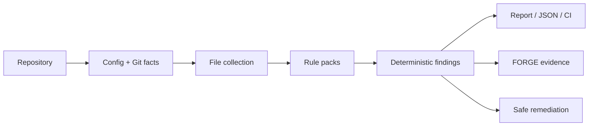

<a name="readme-top"></a>

[](https://godtech-ctl-create.github.io/gODtECH-Steward/)

<p align="center">
  <a href="https://www.npmjs.com/package/@godtech/steward"></a>
  <a href="https://github.com/gODtECH-Ctl-Create/gODtECH-Steward/releases/tag/v0.2.0"></a>
  <a href="https://github.com/gODtECH-Ctl-Create/gODtECH-Steward/actions"></a>
  <a href="./LICENSE"></a>
</p>

<p align="center">
  <strong>Deterministic software and repository housekeeping.</strong><br />
  Scan without guessing. Explain what is unhealthy. Fix only what is safe. Track health with stable evidence.
</p>

<p align="center">
  <a href="https://godtech-ctl-create.github.io/gODtECH-Steward/">Website</a> ·
  <a href="https://www.npmjs.com/package/@godtech/steward">npm</a> ·
  <a href="https://github.com/gODtECH-Ctl-Create/gODtECH-Steward/releases/tag/v0.2.0">Release</a> ·
  <a href="#-quick-start">Quick start</a> ·
  <a href="#-what-steward-checks">What it checks</a> ·
  <a href="#-architecture">Architecture</a>
</p>

---

## ⚡ The 30-second version

**gODtECH Steward** turns software housekeeping into a repeatable engineering step.

It inspects a repository deterministically, produces explainable findings, calculates a health signal, and offers only explicitly supported safe remediation. The normal scan path does not require artificial intelligence (AI), a hosted service, or a model call.

```text
REPOSITORY
    ↓
CONFIG + GIT FACTS
    ↓
FILE COLLECTION
    ↓
RULE PACKS
    ↓
FINDINGS + FINGERPRINTS
    ↓
REPORT / JSON / CI / FORGE EVIDENCE
    ↓
EXPLICIT SAFE REMEDIATION
```

Steward is intentionally focused: it keeps repositories healthy without trying to become another orchestrator, scaffolder, or autonomous coding agent.

## 🚀 Quick start

### Install the current public release

```bash
npm install -g @godtech/steward@0.2.0
steward --version
```

On Windows PowerShell, when script execution policy blocks the generated `.ps1` shim, invoke the Windows command shim directly:

```powershell
steward.cmd --version
```

### Scan a repository

```bash
steward scan .
steward scan . --json
steward doctor .
```

Preview safe remediation:

```bash
steward fix . --safe --dry-run
```

## 🧭 What Steward checks

| Area | Checks |
| --- | --- |
| **Repository** | README, `.gitignore`, large files, disposable tracked artifacts, generated test/tool outputs |
| **Security** | Tracked environment files and high-confidence credential patterns |
| **Documentation** | Broken and malformed local Markdown links |
| **Dependencies** | Package-manager and lockfile consistency, invalid `package.json` |
| **Project metadata** | Package identity and publishable-package metadata completeness |
| **Maintenance** | Merge-conflict markers and TODO/FIXME maintenance markers |
| **Hygiene** | Trailing whitespace and missing final newlines |
| **Reporting** | Health score, severity/category counts, JSON output, stable fingerprints |
| **Rule packs** | Versioned `core` and `security` packs with pack-level or rule-level disabling |
| **Deltas** | Deterministic before/after health and finding changes |
| **FORGE evidence** | Safe observed repository-health evidence for gODtECH FORGE workflows |
| **Trusted packs** | Manifest, compatibility, digest, signature, provenance, revocation, execution admission policy, and bounded WebAssembly runtime contracts |

Steward deliberately does **not** delete uncertain files, rewrite architecture, or require artificial intelligence for deterministic repository facts.

## 🌀 How it works



Rules are read-only analyzers. Findings carry severity, confidence, remediation guidance, and a stable fingerprint. Safe remediation is a separate explicit operation.

## 🛡️ Safety model

**Observe first. Explain second. Modify only when the requested fix is deterministic and explicitly enabled.**

`scan` never writes. `fix` refuses to modify files without `--safe`. `--dry-run` never writes. Security findings are observation-only.

External executable rule packs are not part of the normal scan path. Verification, trust policy, WebAssembly isolation, resource limits, and execution governance remain separate security gates.

## 📦 GitHub Action

Steward ships a composite GitHub Action using the same compiled engine as the CLI:

```yaml
name: Steward

on:
  pull_request:
  push:

permissions:
  contents: read

jobs:
  steward:
    runs-on: ubuntu-latest
    steps:
      - uses: actions/checkout@v4
      - uses: gODtECH-Ctl-Create/gODtECH-Steward@v0.2.0
```

For machine-readable CI output:

```yaml
      - uses: gODtECH-Ctl-Create/gODtECH-Steward@v0.2.0
        with:
          args: '["scan", "--ci", "--json"]'
```

For production, pin the Action to a reviewed release tag or exact commit.

## 📊 Reports and evidence

Write a report:

```bash
steward report . --output current.json
```

Compare against an earlier report:

```bash
steward report . --output current.json --compare previous.json
```

Export observed repository-health evidence for gODtECH FORGE:

```bash
steward forge-evidence . --output .steward-forge-evidence.json
```

Steward's evidence adapter reports observed repository facts only. It does not invent benchmark identities, provider billing, productivity claims, or control-versus-assisted measurements.

## 🔐 Trusted external rule packs

The public `v0.2.0` line contains the complete trusted-pack security chain developed across #33, #34, and #35:

```text
manifest schema
+ exact rule API compatibility
+ allowlist policy
+ trusted publisher
+ publisher / key revocation
+ SHA-256 artifact match
+ Ed25519 signature verification
+ signed provenance
+ trusted source repository policy
+ exact version + digest execution pins
+ structured admission audit record
+ no-import WASM boundary
+ bounded memory / time / input / output / findings
+ isolated worker execution
```

Verification does **not** imply execution. Execution admission is a separate explicit policy decision and fails closed when provenance, trust, compatibility, revocation, or exact pin requirements are not satisfied.

Normal scans and the GitHub Action still do not automatically execute third-party packs. Any future opt-in execution surface must consume the same verification, governance, audit, and bounded-runtime layers rather than bypassing them. See [`docs/trusted-rule-packs.md`](docs/trusted-rule-packs.md) and [`docs/external-rule-api.md`](docs/external-rule-api.md).

## 🔗 gODtECH ecosystem

```text
                    gODtECH FORGE
             orchestration / policy / workflow
                         |
             +-----------+-----------+
             |                       |
             v                       v
        StackPilot                Steward
        BUILD IT             KEEP IT HEALTHY
             |                       |
             +-----------+-----------+
                         v
                   TARGET PROJECT
```

- **gODtECH FORGE** may invoke Steward through the public CLI, JSON result contract, or `forge-evidence` adapter when repository health matters.
- **StackPilot** may consume generic Steward findings while keeping scaffolding and golden-path checks under its own control.
- Neither integration is required for Steward to work.

## 🧠 Architecture

```text
CLI / GitHub Action
        |
        v
Configuration + Git facts
        |
        v
File collector
        |
        v
Versioned rule packs
   |    |    |    |
   v    v    v    v
 repo security docs maintenance ...
        |
        v
Stable findings + fingerprints
     /   |    |    \
    v    v    v     v
 report JSON  CI  evidence
        |
        v
 explicit safe remediation
```

See [`docs/architecture.md`](docs/architecture.md), [`docs/rules.md`](docs/rules.md), [`docs/integration.md`](docs/integration.md), [`docs/deltas.md`](docs/deltas.md), and [`docs/ROADMAP.md`](docs/ROADMAP.md).

## 🧰 Command map

| Command | Purpose |
| --- | --- |
| `steward init` | Create repository-owned configuration |
| `steward scan` | Scan and report repository health |
| `steward doctor` | Diagnose repository health with aggregate counts |
| `steward rules` | Inspect active rule packs and rule states |
| `steward report` | Write JSON health reports and compare deltas |
| `steward forge-evidence` | Export observed health evidence for FORGE |
| `steward fix --safe` | Apply only explicitly supported safe fixes |
| `steward pack verify` | Verify trusted external pack artifacts and report governance admission without enabling normal-scan execution |

## 📍 Status

**Published: v0.2.0**

The public package includes the deterministic engine, CLI, GitHub Action, stable machine-readable contracts, safe remediation model, health deltas, FORGE evidence adapter, StackPilot integration boundary, shared gODtECH CLI identity, trusted-pack verification, the bounded external-WASM runtime, structured audit records, provenance policy, publisher/key revocation, and exact version/digest execution-admission pins.

External pack execution remains intentionally absent from normal scans and the GitHub Action. A future dedicated opt-in execution surface would be a separate reviewed product decision.

## 📄 License

gODtECH Steward is available under the **Apache License 2.0**. See [`LICENSE`](LICENSE).

---

<p align="center">
  <strong>Keep your software healthy.</strong><br />
  <a href="https://www.npmjs.com/package/@godtech/steward">Install from npm</a> ·
  <a href="https://godtech-ctl-create.github.io/gODtECH-Steward/">Visit the website</a> ·
  <a href="https://github.com/gODtECH-Ctl-Create/gODtECH-Steward/releases/tag/v0.2.0">View v0.2.0</a>
</p>
